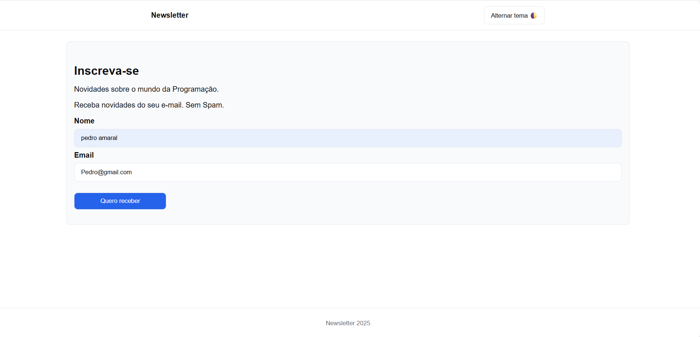

# 📰 Projeto Newsletter

## 📌 Descrição
Este projeto é uma página simples de inscrição em uma **Newsletter** voltada para programação.  
O usuário pode inserir nome e e-mail para se cadastrar e há um botão que alterna entre **tema claro e escuro**.

---

## 🎨 Interface do Projeto

### 🌞 Modo Claro

### 🌙 Modo Escuro

---

## 📁 Estrutura de Arquivos
- `index.html` → Estrutura principal da página.
- `styles.css` → Estilos visuais, incluindo suporte a tema claro e escuro.
- `app.js` → Lógica para alternância de tema e atualização automática do ano no rodapé.

---

## ⚙️ Funcionalidades
- ✅ Formulário de inscrição com campos de nome e e-mail.
- ✅ Alternância de tema claro/escuro com uso de variáveis CSS.
- ✅ Atualização automática do ano no rodapé.
- ✅ Layout responsivo e estilizado com CSS moderno.

---

## 🚀 Tecnologias Utilizadas
- HTML5  
- CSS3 (Flexbox + Variáveis CSS)  
- JavaScript (DOM e Eventos)

---

## ▶️ Como Executar
1. Clone ou baixe este repositório.
2. Abra o arquivo `index.html` em qualquer navegador moderno.
3. Teste o formulário e o botão de alternância de tema.

---

## 🎯 Objetivo
O projeto serve como exemplo prático de integração entre **HTML, CSS e JavaScript** para criar uma página **interativa, moderna e com suporte a temas**.
