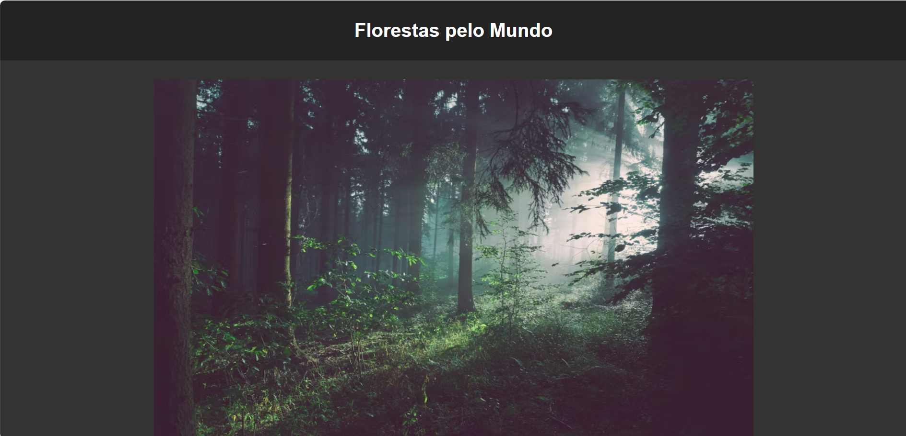

# 📌 Nome do Projeto

## 📝 Descrição
Este projeto é uma aplicação desenvolvida com HTML, CSS e JavaScript com foco em estudos de front-end. Ele apresenta uma interface interativa, organizada e responsiva, aplicando conceitos modernos de desenvolvimento web.

---

## 🖼️ Demonstração da Interface

### 📸 Tela Principal

---

## 📁 Estrutura de Arquivos
- `index.html` → Estrutura principal da aplicação  
- `css/styles.css` → Estilos visuais  
- `js/scripts.js` → Lógica em JavaScript  

---

## ⚙️ Funcionalidades
- ✅ Interface interativa
- ✅ Manipulação de dados com JavaScript
- ✅ Estrutura organizada
- ✅ Layout responsivo
- ✅ Projeto ideal para portfólio

---

## 🚀 Tecnologias Utilizadas
- HTML5  
- CSS3  
- JavaScript  

---

## ▶️ Como Executar
1. Baixe ou clone este repositório.
2. Abra o arquivo `index.html` no navegador.
3. Utilize normalmente a aplicação.

---

## 🎯 Objetivo do Projeto
Este projeto foi desenvolvido com o objetivo de treinar habilidades em desenvolvimento web, lógica com JavaScript e organização de projetos para portfólio profissional.

---

## 👨‍💻 Autor
Pedro Martins 🚀  
Projeto desenvolvido para estudos e portfólio.

