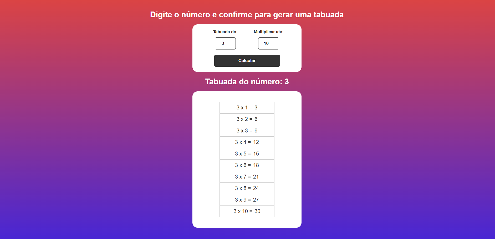

# 🧮 Projeto Tabuada em JavaScript

## 📝 Descrição
Este projeto é uma aplicação simples e interativa que gera a **tabuada de qualquer número** informado pelo usuário. O sistema permite escolher até qual multiplicador deseja calcular, exibindo os resultados dinamicamente na tela.

Projeto ideal para treinar **manipulação de DOM, eventos e lógica com JavaScript**.

---

## 🖼️ Demonstração da Interface

### 📸 Tela Inicial

---

## 📁 Estrutura de Arquivos
- `index.html` → Estrutura do sistema  
- `css/styles.css` → Estilização da interface  
- `js/scripts.js` → Lógica da tabuada em JavaScript  

---

## ⚙️ Funcionalidades
- ✅ Geração de tabuada automática
- ✅ Definição de até qual número multiplicar
- ✅ Atualização dinâmica dos resultados
- ✅ Interface simples, moderna e responsiva
- ✅ Validação para evitar cálculos vazios

---

## 🚀 Tecnologias Utilizadas
- HTML5  
- CSS3  
- JavaScript  

---

## ▶️ Como Executar o Projeto
1. Faça o download ou clone este repositório.
2. Abra o arquivo `index.html` no navegador.
3. Digite um número.
4. Defina até quando multiplicar.
5. Clique em **Calcular** e veja a tabuada aparecer automaticamente.

---

## 🎯 Objetivo do Projeto
Projeto desenvolvido com foco no **aprendizado de JavaScript**, manipulação de eventos, criação de elementos dinamicamente e organização de layouts para portfólio.

---

## 👨‍💻 Autor
Pedro Martins 🚀  
Projeto criado para estudos e desenvolvimento profissional.

