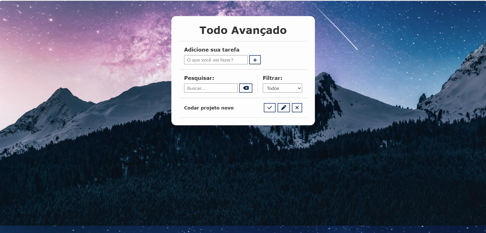

# ✅ Projeto Todo Avançado em JavaScript

## 📝 Descrição
Este projeto é uma aplicação completa de **Lista de Tarefas (Todo List)** desenvolvida com **HTML, CSS e JavaScript puro**, permitindo ao usuário adicionar, editar, remover, pesquisar, filtrar e marcar tarefas como concluídas.  
Os dados ficam salvos automaticamente no **LocalStorage**, garantindo persistência mesmo ao atualizar a página.

---

## 🖼️ Demonstração da Interface

### 📸 Tela Principal do Sistema

---

## 📁 Estrutura de Arquivos
- `index.html` → Estrutura da aplicação  
- `css/styles.css` → Estilização completa da interface  
- `js/scripts.js` → Lógica do sistema (tarefas, filtros, busca e LocalStorage)  
- `img/bg.jpg` → Imagem de fundo do projeto  
- `img_readme/tela.png` → Imagem para o README  

---

## ⚙️ Funcionalidades
- ✅ Adicionar tarefas
- ✅ Editar tarefas
- ✅ Excluir tarefas
- ✅ Marcar como concluída
- ✅ Filtro por:
  - Todas
  - Concluídas
  - Pendentes
- ✅ Pesquisa em tempo real
- ✅ Persistência com LocalStorage
- ✅ Interface moderna e responsiva
- ✅ Animações e feedback visual

---

## 🚀 Tecnologias Utilizadas
- HTML5  
- CSS3  
- JavaScript  
- Font Awesome (ícones)  
- LocalStorage  

---

## ▶️ Como Executar o Projeto
1. Baixe ou clone este repositório.
2. Abra o arquivo `index.html` no navegador.
3. Comece a adicionar suas tarefas.
4. Utilize os filtros, busca e edição livremente.

---

## 🎯 Objetivo do Projeto
Projeto desenvolvido com foco no **aprendizado avançado de JavaScript**, incluindo:
- Manipulação de DOM
- Eventos
- Armazenamento com LocalStorage
- Filtros dinâmicos
- Interface amigável

Ideal para compor **portfólio profissional Front-end**.

---

## 👨‍💻 Autor
Pedro Martins 🚀  
Projeto desenvolvido para estudos, prática e evolução profissional como desenvolvedor Front-end.

