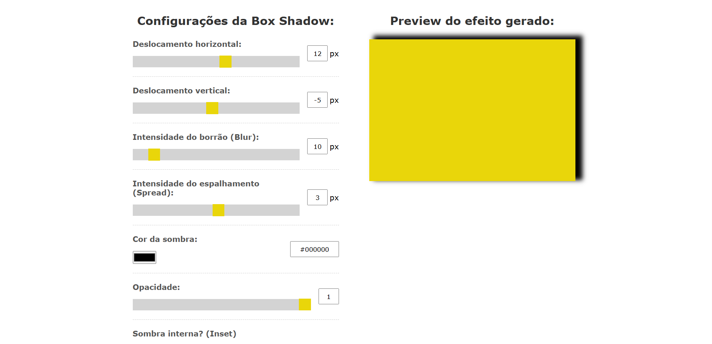
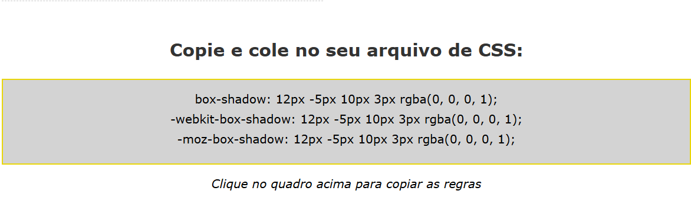

# 🎨 Gerador de Box Shadow com JavaScript

## 📝 Descrição
Este projeto é um **Gerador de Box Shadow interativo**, desenvolvido com **HTML, CSS e JavaScript**, que permite ao usuário criar sombras personalizadas em tempo real, visualizar o resultado e copiar automaticamente as regras prontas para uso no CSS.

Ideal para desenvolvedores que desejam criar efeitos de sombra de forma rápida, visual e prática.

---

## 🖼️ Demonstração do Projeto

### 📌 Tela Inicial

### ✅ Resultado Gerado

---

## 📁 Estrutura de Arquivos
- `index.html` → Estrutura da aplicação  
- `css/styles.css` → Estilização completa da interface  
- `js/scripts.js` → Lógica do gerador de Box Shadow  
- `img_readme/tela.png` → Imagem da tela inicial  
- `img_readme/resultado.png` → Imagem do resultado gerado  

---

## ⚙️ Funcionalidades
- ✅ Ajuste de deslocamento horizontal  
- ✅ Ajuste de deslocamento vertical  
- ✅ Controle de desfoque (blur)  
- ✅ Controle de espalhamento (spread)  
- ✅ Seleção de cor da sombra  
- ✅ Controle de opacidade  
- ✅ Opção de sombra interna (inset)  
- ✅ Preview em tempo real  
- ✅ Geração automática das regras:
  - `box-shadow`
  - `-webkit-box-shadow`
  - `-moz-box-shadow`
- ✅ Copiar regra com apenas um clique  
- ✅ Layout responsivo para dispositivos móveis  

---

## 🚀 Tecnologias Utilizadas
- HTML5  
- CSS3  
- JavaScript  
- Manipulação de DOM  
- Clipboard API  

---

## ▶️ Como Executar o Projeto
1. Clone ou baixe este repositório.
2. Abra o arquivo `index.html` no navegador.
3. Utilize os controles para gerar sua sombra personalizada.
4. Clique no quadro das regras para copiar automaticamente.
5. Cole sua sombra diretamente no seu CSS.

---

## 🎯 Objetivo do Projeto
Projeto desenvolvido com foco no **aprendizado prático de JavaScript**, incluindo:
- Classes (POO)
- Eventos
- Conversão de cores (Hex para RGB)
- Atualização dinâmica de estilos
- Copiar texto para a área de transferência

Perfeito para integrar ao **portfólio Front-end**.

---

## 👨‍💻 Autor
Pedro Martins 🚀  
Projeto desenvolvido para estudos e evolução como desenvolvedor Front-end.

