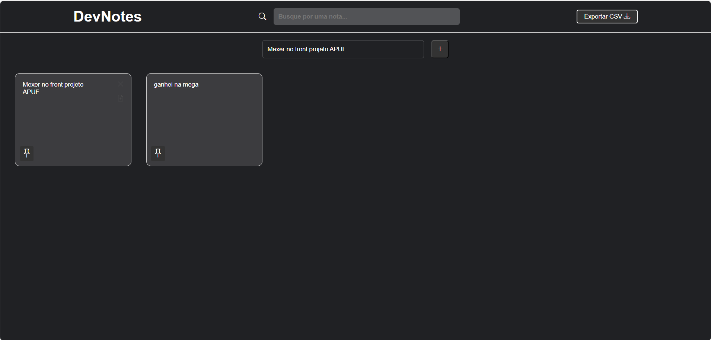

# 📝 DevNotes - Aplicação de Bloco de Notas

## 📌 Descrição
O **DevNotes** é uma aplicação web de bloco de notas interativa, desenvolvida com **HTML, CSS e JavaScript**, que permite criar, editar, fixar, duplicar, excluir, pesquisar e exportar anotações em formato **CSV**.  
Todas as informações são salvas automaticamente utilizando o **LocalStorage** do navegador.

---

## 🖼️ Demonstração do Projeto

### ✅ Tela Inicial

---

## 📁 Estrutura de Arquivos
- `index.html` → Estrutura principal da aplicação  
- `css/styles.css` → Estilização completa da interface  
- `js/scripts.js` → Lógica da aplicação (CRUD de notas, busca, exportação, LocalStorage)  
- `img_readme/telainicial.png` → Imagem da tela inicial  

---

## ⚙️ Funcionalidades
- ✅ Criar novas notas
- ✅ Editar notas em tempo real
- ✅ Fixar notas
- ✅ Duplicar notas
- ✅ Excluir notas
- ✅ Pesquisar notas por conteúdo
- ✅ Exportar todas as notas em CSV
- ✅ Salvamento automático com LocalStorage
- ✅ Interface moderna inspirada no Google Keep
- ✅ Layout responsivo

---

## 🚀 Tecnologias Utilizadas
- HTML5  
- CSS3  
- JavaScript  
- Bootstrap Icons  
- LocalStorage  
- Manipulação de DOM  

---

## ▶️ Como Executar
1. Baixe ou clone este repositório.
2. Abra o arquivo `index.html` no navegador.
3. Comece a criar suas anotações.
4. Utilize a busca para filtrar.
5. Exporte suas anotações em CSV quando quiser.

---

## 🎯 Objetivo do Projeto
Projeto desenvolvido para treinar na prática:
- Manipulação do DOM
- Eventos
- Persistência de dados com LocalStorage
- Manipulação de arquivos (Exportação CSV)
- Organização de estados da aplicação

Ideal para utilização em **portfólio Front-end**.

---

## 👨‍💻 Autor
Pedro Martins 🚀  
Projeto desenvolvido com foco em aprendizado e evolução no desenvolvimento Front-end.

