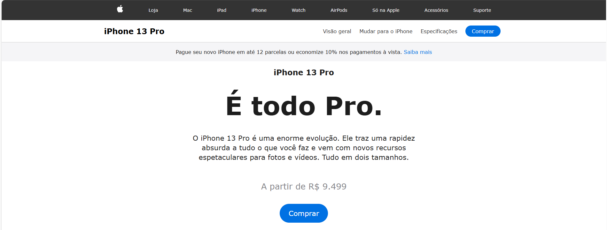
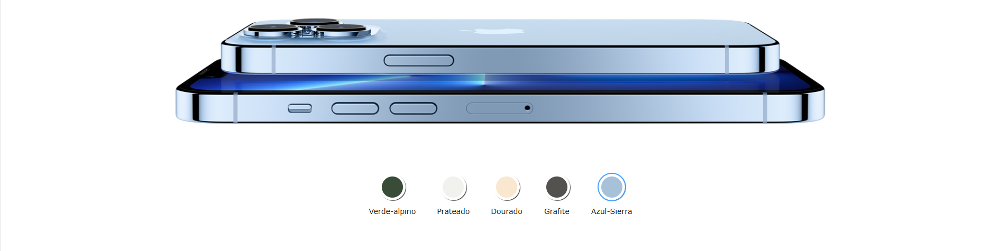

# 📱 iPhone 13 Pro — Landing Page Interativa

Projeto front-end inspirado na página oficial da Apple, desenvolvido com foco em **interatividade, design moderno e manipulação do DOM com JavaScript**. O usuário pode alternar entre as cores do iPhone e visualizar a mudança em tempo real.

---

## 🖼️ Demonstração do Projeto

### Tela Inicial


### Troca de Cor do Aparelho


---

## 📝 Descrição do Projeto

Esta aplicação simula uma **landing page profissional do iPhone 13 Pro**, permitindo a troca dinâmica da cor do produto através da interação do usuário. O sistema atualiza automaticamente a imagem conforme a cor selecionada, com um efeito suave de transição.

Projeto desenvolvido para fins de **aprendizado prático em JavaScript, HTML e CSS**, com foco em:
- Interação com o usuário
- Manipulação do DOM
- Layout moderno e responsivo

---

## 🚀 Funcionalidades

- ✅ Layout inspirado no site oficial da Apple  
- ✅ Troca dinâmica das cores do iPhone  
- ✅ Atualização automática da imagem do produto  
- ✅ Efeito de transição suave ao trocar as cores  
- ✅ Layout totalmente responsivo (mobile e desktop)  
- ✅ Código limpo e organizado  

---

## 🛠️ Tecnologias Utilizadas

- **HTML5** — Estrutura do projeto  
- **CSS3** — Estilização e responsividade  
- **JavaScript (Vanilla)** — Manipulação do DOM e eventos  

---

## 📂 Estrutura de Pastas

```bash
📁 projeto-iphone
 ┣ 📁 css
 ┃ ┗ 📄 styles.css
 ┣ 📁 js
 ┃ ┗ 📄 scripts.js
 ┣ 📁 img
 ┃ ┣ 📄 iphone_green.jpg
 ┃ ┣ 📄 iphone_silver.jpg
 ┃ ┣ 📄 iphone_golden.jpg
 ┃ ┣ 📄 iphone_grafite.jpg
 ┃ ┗ 📄 iphone_blue.jpg
 ┣ 📁 img_readme
 ┃ ┣ 📄 telainicial.png
 ┃ ┗ 📄 corcelular.png
 ┗ 📄 index.html

---
▶️ Como Executar
Baixe ou clone este repositório.
Abra o arquivo index.html no navegador.
Comece a criar suas anotações.
Utilize a busca para filtrar.
Exporte suas anotações em CSV quando quiser.
---
👨‍💻 Autor
Pedro Martins 🚀
Projeto desenvolvido com foco em aprendizado e evolução no desenvolvimento Front-end.
